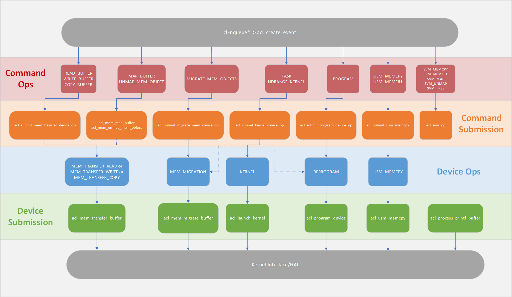
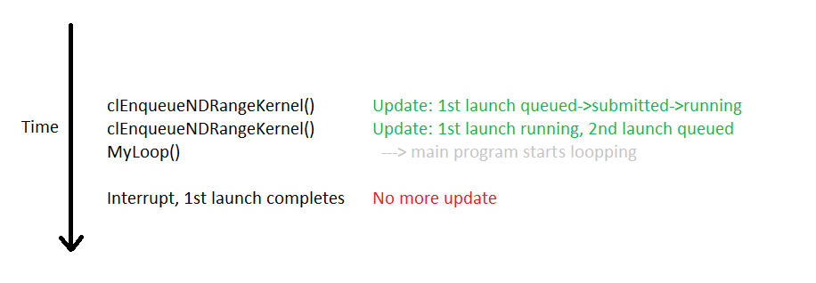
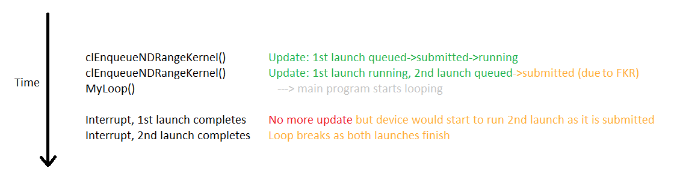
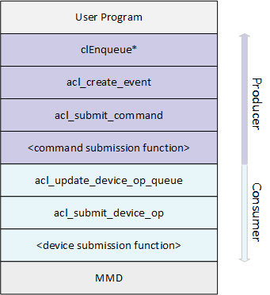
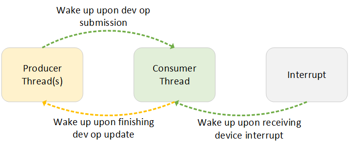
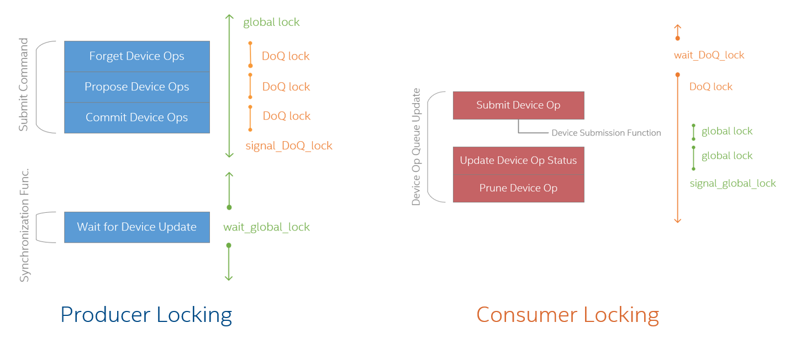
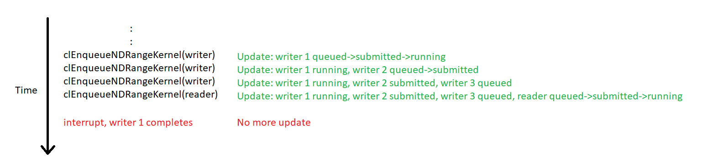

# Eager Progress

## Overview

This document describes the new eager progress model in OpenCL runtime for synchronizing and scheduling operations that interacts with the devices in the system.

Currently, the OpenCL runtime updates user event status and makes forward progress through two mechanisms:
1. Explict update when one of the two synchronization API, `clFlush` or `clWaitForEvents`, is called
2. Implict update when any new operation is enqueued through a `clEnqueue*` call

The second mechanism is called cooperative scheduling, which is used to ensure forward progress between different command queues and different contexts, as well as an immediate launch of the operation whenever possible when the explict synchronization calls are not used. With that being said, a clear disadvantage of cooperative scheduling is that it does not timely propagate device emitted status updates, which are usually through interrupts, to the user level event. This sometimes leads to hung in the user designs not using the explicit synchronization calls.

To address potential hung, the runtime will be refactored to abandon the cooperative scheduling mechanism and adopt a new multi-producer single-consumer model, where any updates from either the device or the other user level events will trigger an update in the background, hence making an eager progress in the runtime.

With this new model, the main thread of a program as well as any user-spawned threads will act as one or more producers that submits device operations to a circular buffer, i.e., the device operation queue. The runtime will spawn a single background thread that acts like the consumer of the buffer, which will submit any non-conflicting device operations to the target device, as well as processing status updates received throughout its execution. While this feature should ensure functional correctness of a user program, the performance should not be negatively impacted if not improved. <!-- TODO: refine expected benefits vs. cost -->

## Background

This section outlines some of the **current** runtime features to facilitate understanding of the proposed new feature. For more details, please find ###<!-- TODO: put my queue.md link here -->.

Before looking into the details, some concepts involved are:
- Event
  - A `cl_event` object, also referred to as a 'command'
  - User-level tracking token for `clEnqueue*` functions
- Command queue
  - A user-created queue for scheduling dependency between events, can create multiple in the program
  - Has two flavors, in-order queue or out-of-order queue
  - Will only submit a event to the device operation queue if all dependencies are resolved (In case of in-order queues, only the event at the top of the queue)
- Device operation (abbr. device op, or dev op)
  - An operation that requires interaction with one or more devices
  - An event can map to zero (no device interaction required) to multiple device ops, which are marked as one device op group
- Device operation queue (abbr. device op queue, DoQ)
  - Runtime managed queue for scheduling device ops, there is only a single device op queue for all command queues and devices
  - Implemented as a circular buffer, more details later
  - Determines if a device operation can be submitted based on a conflict matrix

### Submitting a User Command

Currently a user command is translated to a device operation as depicted in the following figure.

1. Every `clEnqueue*` function will create an event with the right **command operation** type and submit it to the target command queue using `acl_create_event`.
2. For commands needing interation with the device, a corresponding **command submission function** will be called if there is no more pending dependencies.
3. The command submission function will propose corresponding **device operations** to the device op queue.
4. The device op queue will schedule submission of device operations. Devices ops are submitted to the device using its the corresponding **device submission function**, which interacts with the MMD.
5. Device operation execution status may be updated by the runtime, or by interrupt handlers for device interrupts This status then propagates back to the owning event, when the device op queue is updated.

||
|:--:|
|Figure 1:  Translation of a user enqueue call to its device operation mapping|

Note that for `MAP_BUFFER` and `UNMAP_MEM_OBJECT`, the command operation might be trivial if no memory transfer needs to occur for the operation to complete. In that case, these command operations will not be translated to device operations (denoted as dotted line in the figure).

For the `TASK` and `NDRANGE_KERNEL` command operations, it might be optionally mapped to a `REPROGRAM` device operation if the binary currently programmed on the device does not match the kernel, and it might be optionally mapped to a `MEM_MIGRATION` device operation if any of the kernel arguments needs migration (denoted as dotted line in the figure).

### Device Operation Queue

The device op queue accepts and schedules device operations based on resource availability determined through a [conflict matrix](https://github.com/intel/fpga-runtime-for-opencl/blob/9c8c79567231fd7d93f61fa209c51fc525357d13/src/acl_device_op.cpp#L107-L151). As illustrated by figure 2, it is implemented as a circular buffer with three subqueues, each containing device ops of different states:

<table>
    <thead>
        <tr>
            <th>Subqueue</th>
            <th colspan=3>Possible device op state</th>
        </tr>
        <tr>
            <th></th>
            <th>free</th>
            <th>proposed</th>
            <th>committed</th>
        </tr>
    </thead>
    <tbody>
        <tr>
            <td>Live queue</td>
            <td></td>
            <td>x</td>
            <td>x</td>
        </tr>
        <tr>
            <td>Committed queue</td>
            <td></td>
            <td></td>
            <td>x</td>
        </tr>
        <tr>
            <td>Free queue</td>
            <td>x</td>
            <td></td>
            <td></td>
        </tr>
    </tbody>
</table>

As mentioned before, a single user level event might be decomposed into several device ops, which can be in either a proposed state or a committed state when live. When a device op is created, an free device op will be populated and added to the live queue, which changes its state to proposed. If any of the subsequent device operations generated from the same user level event fail to submit, then this device operation will be revoked and added back to the free queue. If all of the device operations generated from the same user level event are successfully created and submitted, then the runtime will change the state of those device operations to committed by adding them to the committed queue. After the device operation is done, its state will be changed back to free and added back to the free list.

||
|:--:|
|Figure 2:  Device operation queue|

Each device op keeps track of two status, `status` and `execution_status`, the former is the status known by the device op queue whereas the later is the status known by the actual device, as a result `execution_status` should always be ahead of `status`. When `status` and `execution_status` do not match, that signifies a device update has been made for the first time to the runtime The runtime will propagate the device op status to its owning event only in this case. The following table details the four statuses and their update mechanisms only for `execution_status`, but device op status and event execution status can also take values from the listed four statuses (update mechanisms vary).
| device op execution status | Updated by runtime | Updated by device interrupt |
| --- | --- | --- |
| `CL_QUEUED` | x | |
| `CL_SUBMITTED` | x | |
| `CL_RUNNING` | x | x (Kernel) |
| `CL_COMPLETE` | x | x (Kernel and DMA) |

Update of the device op queue is done with the function `acl_update_device_op_queue`, which calls `l_update_device_op_queue_once` in a loop until no further updates can be made. Each loop iteraction has three subtasks, each of these subtasks will traverse through the commited queue once:
1. Check if there is any device ops to be submitted to device, submit if no conflict
2. Check if there is any update from the device on device op execution status, post that status to user event
3. Check if there is any completed device op, if so, prune that op and return it to the free list

### Kernel Launch Conflict and the Impact of Fast Kernel Relaunch

This section outlines a specific scenario where the current cooperative scheduling of the runtime fail to make forward progress and results in a hung.

Before describing this scenario, we need to understand the special conflict type that kernel launches face other than the ones listed within the aforementioned conflict matrix. On an FPGA accelerator device, although multiple different kernels are permitted to be executed in parallel, multiple invocation of the same kernel can only be executed sequentially. As a result, only one kernel device op resulting from the launch of the same kernel may be in a `CL_SUBMITTED` or `CL_RUNNING` status at a given time.

The hung happens when a long-running kernel is launched multiple times, and then the main user program waits in a loop to check for kernel launch completion without using explicit synchronnization APIs. Since updates are only made when `clEnqueue*` is called, if the completion interrupt comes after the last call to `clEnqueue`, the runtime will not able to recognize that the kernel run is completed, thus will not launch the next kernel device operation, as illustrated in figure 3.

||
|:--:|
|Figure 3:  Runtime hung when launching the same kernel for multiple times, without fask kernel relaunch|

This scenario is mitigated by the introduction of the fast kernel relaunch feature, which enables submission of the kernel device op generated by the launch of the same kernel by `fast_launch_depth` number of time, where `fast_launch_depth` is the depth of the kernel argument preload buffer. (For more details on the Fast Kernel Relaunch feature, please find it in the [Fast Kernel Relaunch FD](https://github.com/intel-innersource/applications.fpga.oneapi.products.acl-docs/blob/986fe42ff647c2a264ed9a440bec3d27dcec3a05/FDs/runtime/opencl_fast_kernel_relaunch_fd.docx).) With this feature, there can be `fast_launch_depth`+1 number of kernel device ops in either a `CL_SUBMITTED` or `CL_RUNNING` status, which would resolve the above example illustrated in Figure 3 as now the second kernel device op can be launched without the first kernel device op getting completed.

||
|:--:|
|Figure 4:  Hung resolved when launching the same kernel for multiple times with fask kernel relaunch, depth=1|

However, even with the fast kernel relaunch feature, the number of kernel device ops that can be submitted at one time is still limited by the `fast_launch_depth`. As long as there are more than `fast_launch_depth`+1 numbers of same kernel launches, the hung will persist.

### Runtime Locking and Synchronization

Currently, despite that the user program can have multiple threads created, the runtime is inherently single threaded due to its locking scheme. It employs a single in-house asynchronous-safe condition variable `acl_condvar_s` and locks the member lock `waiter_mutex` at the beginning of any OpenCL API calls, i.e., treating everything as critical region. The reason we need a asynchronous-safe condition variable is for interrupt signal handlers to safely wake up any threads waiting for device update.

The following code snippet shows the `acl_condvar_s` construction. The details on how the implementation achieve asynchronous-safe is out-of-scope of this document, please see [acl_threadsupport library](https://github.com/intel/fpga-runtime-for-opencl/blob/9c8c79567231fd7d93f61fa209c51fc525357d13/lib/acl_threadsupport/src/acl_threadsupport.c) for more information.

```cpp
struct acl_condvar_s {
#ifdef __linux__
  pthread_mutex_t waiter_mutex;
#else
  CRITICAL_SECTION waiter_mutex;
#endif

  acl_sem_t signal_sem;

  int entry_q;

  unsigned num_waiters[2];
  acl_sem_t passive_sem[2];

  unsigned timedout[2];
};
```

Note that to follow RAII practice, the runtime uses a wrapper class `acl_mutex_wrapper_t` around the `acl_condvar_s` type condition variable, which defines the four locking functionalities necessary for the *C++ BasicLockable* requirement: `lock()`, `unlock()`, `suspend_lock()`, and `resume_lock()`. This enables usage of `std::unique_lock` and `std::scoped_lock` with the in-house condition variable, with the limitation that `std::scoped_lock` may only be constructed with a single instance of the `acl_mutex_wrapper_t` class due to a lack of `try_lock()` functionality.

## Feature Breakdown

This section describes the specifics of the feature, as well as its related implementation ideas.

### Multi-Producer Single-consumer Model

The main module of the eager progress feature is the multi-producer single-consumer model that the runtime will adopt. In this model, the device op queue is the shared buffer that both producer(s) and consumer will access. The producer(s) will be the user threads of the program, they will be referred to as either 'producer thread(s)' or 'user thread(s)' in this document. The consumer will be a new background thread spawned by the runtime, it will be referred to as either the 'consumer thread' or the 'background thread' in this document.

Comparing to the old runtime where everything (other than interrupts) is run in the user threads, the new model will factor out the function `acl_update_device_op_queue` and run it as the main body of the background thread. The background thread will be spawned when the first context in the program is created, and it will be joined when any last context in the program gets releases, at any point in the program. That is, if a context is created after all previous contexts were created and released, a new background thread will spawn at its creation. A potential way to mark the creation of the first context or the release of the last context currently in the program is to add a static counter of context number, and only spawn the background thread when this counter changes from 0 to 1, only join the background thread when this counter changes from 1 to 0.

This decision is made based on the behaviour that devices are opened when contexts are created, from which interaction with the devices becomes possible, hence device ops can be submitted to the device op queue. Another option is to create the background thread when acl_platform is initialized, since the device op queue is a member of the platform. However, this option is less favorable as there is no logical place to join the created background thread since the platform is only initialized once but never explicitly destroyed. Not joining the background thread causes thread sanitizer warnings in our runtime unit tests, therefore this option is ruled out.

With the execution of `acl_update_device_op_queue` moving to the background thread, the submission functions detailed in figure 1 will be split between the producer and the consumer threads, where the producer threads will be in charge of the command submission functions and the consumer thread will be calling the device submission functions, as shown in figure 5.

||
|:--:|
|Figure 5:  Function calls divided between producer threads and consumer thread|

### Synchronization

Since access to the device op queue will be shared between the producer thread(s) and the consumer thread, a new condition variable is needed[^1] to synchronize the threads. With that being said, there is one more agent that requires synchronization: the device side interrupt. The device interrupt handler changes the execution status of a submitted device op, which is an update the background thread has to pick up. Therefore, in this new model, we will have two condition variables synchronizing three types of agents in the runtime:
* Condition variables:
  * Global condition variable (abbr. global CV)
  * Device_op queue condition variable (abbr. DoQ CV)
* Agents:
  * Producer threads
  * Consumer thread
  * Interrupts

To avoid burning CPU, the consumer thread will wait on the DoQ CV when no updates are available from the producer thread(s), or the interrupts. The producer threads update the device op queue by proposing and committing/forgetting device ops. When there are new committed or forgotten device ops, they should signal the consumer thread to wake up. For the interrupt handlers, they should signal the consumer when the interrupt stems from a device update. In general, places where `acl_update_device_op_queue` <!-- TODO: probably except for the invocation in acl_command_queue.cpp --> and `acl_signal_device_update` is called in the current runtime would be a candidate location for waking up the background thread.

In case when the explict runtime synchronization APIs, `clWaitForEvents` and `clFlush`, are called on events targetting a device that uses interrupts, the producer threads wait on the global CV. In the old runtime, the interrupt handlers are responsible for waking these threads up, but now with them waking up the background thread, the background thread is responsible for propagating device updates to the user threads, by signalling the the user threads when there is a change in `execution_status` from `CL_SUBMITTED` to `CL_RUNNING` for kernel device ops, and when there is a change in `execution_status` from `CL_RUNNING` to `CL_COMPLETE` for memory device ops<!-- TODO: check when exactly for memory device ops -->.

[^1]: A note on implementation, currently the mutex wrapper class `acl_mutex_wrapper_t` implements the *BasicLockable* functions only pertaining to the global CV. In order to introduce new condition variables, the wrapper class needs to be extended to be able to lock an arbitrary lock. This can possibly be done by adding a CV data member to the wrapper class.

||
|:--:|
|Figure 6:  Synchronization between the three agents in the multi-threaded runtime model|

### Locking Scheme

Since the introduction of the multi-producer single-consumer model would change the runtime from an inherently single-threaded library to a multi-threaded one, the locking scheme will also need to be refactored. The `waiter_mutex` lock from the two condition variables will be used to guard data resources in the following way:
* `waiter_mutex` from the global CV (abbr. global lock) will guard access to the runtime constructs such as `cl_context`, `cl_kernel`, etc.
* `waiter_mutex` from the DoQ CV (abbr. DoQ lock) will guard access to the device op queue

While it is easy to make the threads acquire both locks when doing their work, the goal is to make sure the background thread hold the global lock for the least possible execution time with functionality guarantees so that the user thread are not blocked from performing their tasks.

To make it easier to design the locking scheme and less error-prone, the three subtasks done in `l_update_device_op_queue_once` will be refactor into three sub-functions, `l_attempt_submit_single_device_op`, `l_update_device_op_status`, and `l_prune_completed_device_ops`<!-- TODO: names are subjected to change -->, where each will perform a different locking scheme based on the resources they need.

At the proposal phase of this feature, the first attempted locking scheme is as illustrated by figure 7.

<!-- TODO: Change text to match diagram -->
||
|:--:|
|Figure 7:  Initial new locking scheme proposal for the multi-producer single consumer model|

On the producer side, not much will be changed, all the producer functions will continue to hold the global lock and have a pseudo-single-threaded behaviour. Only only change is that the functions that submits new device ops to the device op queue, `acl_propose_device_op`, `acl_forget_proposed_device_ops`, and `acl_commit_proposed_device_ops` will need to hold the DoQ lock as they directly modifies structure of the device op queue. Note that when the producer threads calls these functions, the global lock will continue to be locked regardless of the locking of the DoQ lock. This is because we may have multiple producer threads that attempt to propose and commit to the device op queue at the same time. Without holding the global lock, one producer can just finish proposing and another producer can come in, propose, and forget device ops on error, then the second producer will forget not only the device ops proposed by itself, but also the device ops proposed by the first producer. Making the producers hold the global lock while submitting the device ops ensures that at any point when the global lock is released, there should not be any uncommitted device ops.

On the consumer side, we will look at the three sub-functions separately. The first sub-function, `l_attempt_submit_single_device_op`, holds the DoQ lock and loops through the committed subqueue of the device op queue to check if there is any device ops that can be submitted to the device. If any of the device ops can be submitted, it will break the loop, release the DoQ lock (to avoid potential deadlock, more on this later) and submit that single device op. The goal is to not hold the global lock while looping through the committed queue and only acquire it during the actual submission of the device op[^2], since many of the device submission functions modifies broader runtime constructs, for example, fields under `cl_device` may be changed by device submission function `acl_program_device`. <!-- TODO: releasing the DoQ lock in the middle of the course might lead to lost wake-up. Say the consumer went through submit stage and nothing needs to be submitted, then it releases the lock. At this point, the producer comes in and commit something to the device op queue, then wake up the consumer, but the consumer is not waiting so this wake up will do nothing. The consumer continue to update and prune, find no more update, goes to wait, but it actually shouldn't. --> <!-- Note regarding my TODO: this might not be the case if our synchronization is semaphore  based -->

[^2]: It is possible that during the course of implementation we find the global lock has to be acquired while resolving conflicts, the initial proposal would have to be modified accordingly.

The second sub-function, `l_update_device_op_status` will need to acquire the global lock as well as the DoQ lock because it checks various runtime constructs (in certain cases) while traversing the device op queue. Holding the global lock becomes especially important in the case where fast kernel relaunch is enabled on same kernel launches with explicit event dependencies. Originally an event can only be submitted to the device op queue when all its depended-on events completes, however, for two events generated from launching the same kernel where event2 explicitly depends on event1, with fast kernel relaunch, event2 can be submitted to device op queue when event1 is in a `CL_SUBMITTED` or `CL_RUNNING` status. This case creates an exception where the consumer thread has to run the producers' command submission function: upon receiving a status change in event1's kernel device op, the background thread need to submit event2 to the device op queue. Since the update function of the background thread is the earliest point we can submit such command to the device op queue, any other methodology that arranges the producer threads to pick up the submission task will have worse performance. As a result, this exception will be tolerated and global lock will be acquired to eliminate contention[^3].

[^3]: Note that when the consumer calls the command submission function, it would already have acquired the DoQ lock, given that the propose, forget, and commit functions tries to acquire the DoQ lock again, the DoQ lock might need some kind of a recursive locking functionality.

The last subfunction, `l_prune_completed_device_ops`, is the simplest one when coming to the locking scheme. It simple traverses the device op queue and put any completed device op back to the free list. Since it only modifies the device op queue, we only need to lock the DoQ lock.

Lastly, it is not safe to hold lock in the signal hangler, therefore, the locking scheme does not apply to the interrupt handler functions.

#### Atomic Variables

Given that the initially proposed locking scheme is subjected to changes, there might be several variables that needs to be modified to use atomic read-write accesses.

One candidate is the `num_printf_bytes_pending` data memeber of the device op info struct. Its value will be updated by all three agents in the runtime, and there is a possibility of read-write race when the consumer is reading it while not holding the global lock in the submit subtask and the producer is updating its value.

Another candidate is the `refcount` value of the `acl_kernel_invocation_wrapper_t`. The update subtask of the consumer thread might set it to 0 if the kernel has completely finished, which returns it to the unused invocation wrapper pool that can be picked up by the producer thread while launching a kernel. This value will be protected if the initial locking scheme proposal is unchanged, but if the update subtask no longer holds the global lock, this value would need to be atomic.

#### Device Operation and Event Status Update

As mentioned in the [Device Operation Queue](#device-operation-queue) section in this document, the update mechanisms of the device op `execution_status`, the device op `status`, and the event `execution_status` vary. In general, device op `execution_status` gets updated first, then propagate to device op `status`, and lastly event `execution_status`, and no backward progress can be made (e.g., from `CL_RUNNING` to `CL_SUBMITTED`). The following describes the agents that may update the above three status members<!-- TODO: check information accuracy -->:
| Status Member | Updated by Producer | Updated by Consumer | Updated by Interrupt |
| --- | --- | --- | --- |
| device op `execution_status` | x | x | x |
| device op `status` | x | x | |
| event `execution_status` | x | x | |

Even though all three status members may be updated by at least two agents, due to the information flow and the no-backward-progress policy, we should not expect any contention when coming to the status updates.

### Issues of Multi-Threaded Programs

This section describes some common issues found in multi-threaded programs, and ideas to resolve them when they are encountered during implementation.

#### Deadlock Resolution

With the introduction of a second condition variable, the chances of having deadlocks significantly increases.

Since the proposed locking scheme is a relative simple one, one way to reduce the possibility of having deadlocks is to make sure whenever both locks are acquired, they are always acquired in the same order<!-- TODO: can probably put a reference for this? -->. 

In the case where acquiring the locks in different order is unavoidable in implementation, another potential solution would be to extend the current *BasicLockable* functions to *Lockable* by implementing a `try_lock()` functionality. Note that we need to have the performance implications in mind when using the `try_lock()` functionality.

#### Lost Wake-Up

A scenario where lost wake-up could happen is when the signal on the DoQ CV from the interrupt handlers fires when the background is about to but not yet wait on the DoQ CV, since we cannot lock in the interrupt handler. If no more interrupt or host side enqueue happens after a lost wake-up, the background thread will wait forever and hung results.<!-- TODO: semaphore implementation of CV might mitigate this issue, investigate -->

### TODO: other issues

* An exception in the device submission functions that can be called by both producer(s) and consumer is the `acl_program_device` function
* Profiler scan function `acl_process_profiler_scan_chain` modified kernel's `profile_date` buffer, both consumer and producer do that so contention. Might need to add a lock just for `profile_data`?

## Use Case

In most use cases, users will not be able to functionally distinguish between the old OpenCL runtime that uses coorperative scheduling and proposed one that makes eager progress. The scenario where there will be a functional difference is when cooperative scheduling results in a hung as describe in the [Kernel Launch Conflict and the Impact of Fast Kernel Relaunch](#kernel-launch-conflict-and-the-impact-of-fast-kernel-relaunch) section. A more specific example of the depicted scenario is the usage of host pipe kernels without using explicit synchronization APIs, which is explained in the following section.

### Host Pipes Kernel

Host pipes, or in this case, Tanner pipes, consists of a ring buffer implemented with USM host pointer and two kernels for reading and writing to the ring buffer. When a `write` is called on the pipe, the host-to-device kernel will be running to write to the correct index of the buffer, and when a `read` is called, the device-to-host kernel will be running to read value from the correct index of the buffer. Both `read` and `write` comes in two flavors, blocking and unblocking, where the blocking read or write waits in a loop until the value is successfully read or written. The key in blocking read or write is that these SYCL calls do not translate to any one of the two explicit OpenCL synchronization APIs, which perfectly satisfies the condition for a hung to occur.

The following snippet shows an example where the hung happens, the first for-loop would launch the write host-to-device kernel (referred to as writer in the following passages) three times, and the second for-loop would launch the read device-to-host kernel (referred to as reader in the following passages) for once.

```cpp
// include ...

#define N 3

using result_pipe = sycl::ext::intel::prototype::pipe<class _result_pipe, int, 1>; 

struct writer {
  void operator()() const {
    result_pipe::write(4);
  }
};

int main ()
{
  sycl::queue q{testconfig_selector{}, &m_exception_handler};

  for (int i = 0; i < N; i++)
  {
    q.single_task(writer{});
  }

  for (int i = 0; i < N; i++) {
    // Blocking read
    std::cout << result_pipe::read(q) << "\n";
  }
}
```

With a default fast kernel relaunch depth of 1, the third writer launch would not be able to proceed due to the first writer launch running and the second writer launcg submitted. The reader would be launched without issues because it is a different kernel. When the first writer finishes, there is no more status update to the device op queue in the runtime, as a result, the third writer will never be launched and the blocking read will never return.

||
|:--:|
|Figure 8:  Execution timeline of the example host pipe program|

With the runtime making eager progress, when the complete interrupt comes from the first launch of the writer kernel, it will wake up the background thread to update the device op status in the device op queue, which will unblock launching the writer kernel for the third time. With the third writer launched, the reader will eventually read all the values from the ring buffer, hence resolves the hung.

### Performance Impact

Although users will not detect any functional difference in most of the cases, there might be a performance improvement resulting from making the runtime eagerly progress. <!-- TODO: elaborate when test data becomes available? -->


The key is to show the implications on other teams and components.
For example, define what your feature depends on what depends on your feature.
In another word, state your assumption you have when at the time of the design.

## Testing

The testing of this feature comes in two flavors: unit tests and regression tests. Since this is a runtime-only feature, the two sets of tests can be conducted simultaneously. Both functionality and performance of the runtime will be accessed and compared to the old runtime.

### Unit Tests

1. All existing unit tests will be used for sanity checking functional correctness
2. Create context after releasing all currently existing context and see if the background thread is spawned

### Regression Tests

1. Extend existing multi-thread regression tests to test for the multi-producer case
2. `kernel_latency` regression test will be used to check performance impact of the feature
3. SYCL benchmark CHStone tests, these are tests that hung with cooperative scheduling, make sure they all pass

## Future work

Look into C++ primitives that can be used to replace the in-house condition variable. Some candidates are `std::counting_semaphore` and `std::atomic` which contains function members `wait`, `notify_one`, and `notify_all`. Unfortunately, these primitives are all from the C++20 standard, which the runtime does not use, so we have to either look for alternatives, or adopt these primitives in the future.

## Version

| Version| Contributors|Date      |Description of changes|
|--------|-------------|----------|----------------------|
| V1.0   |Sophie Mao   |2022-12-21|Initial proposal      |